# Arcane-Research

Ported version of Thaumcraft 6 for Minecraft 1.20.1 Forge

> ## Port is \\\\\\\~94% complete
> UPD: Full port biome, structure

> Forge 47.3.0 + terrablender:3.0.1.10 + JEI + Curios

## Showcase

  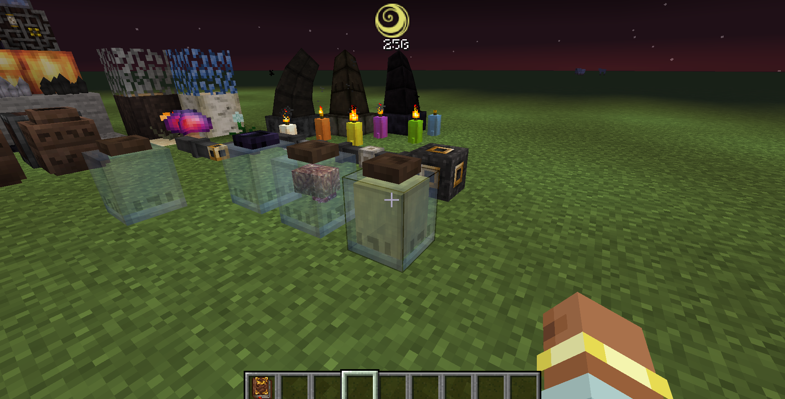
  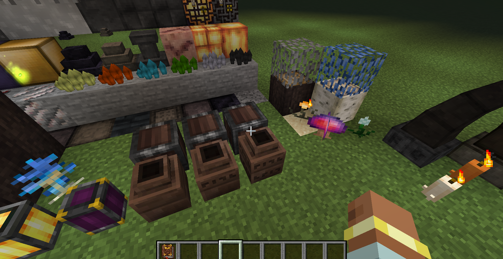
   
  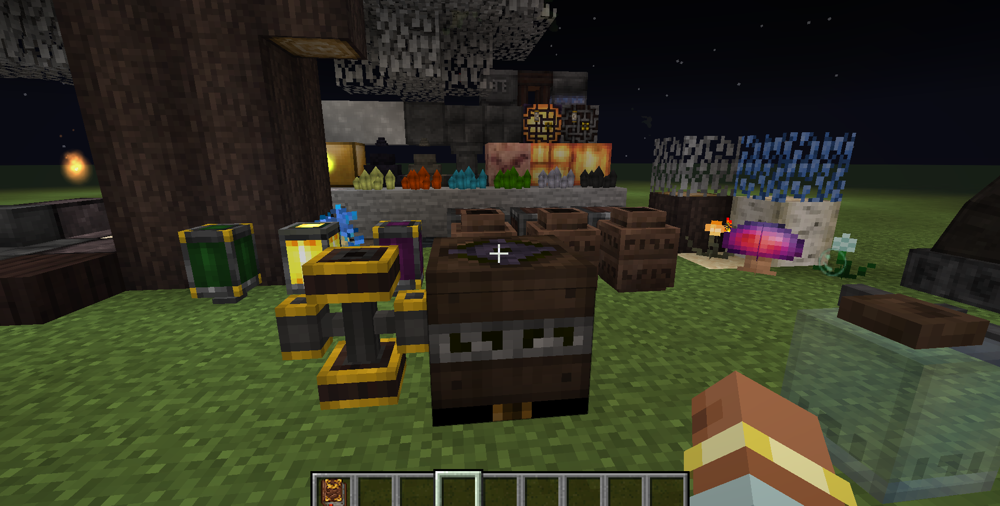

  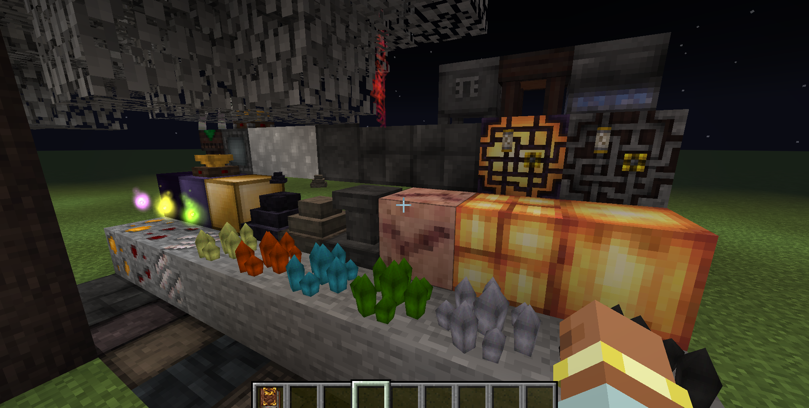
  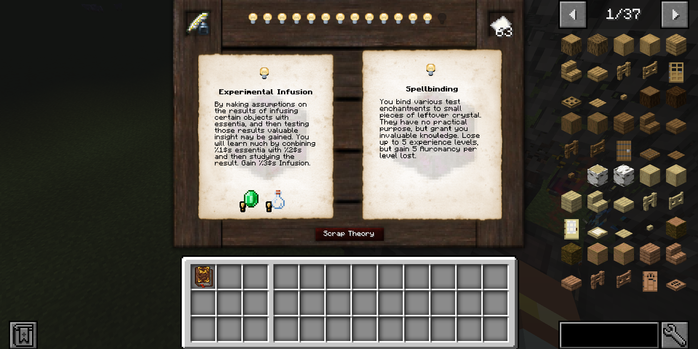
   
  

  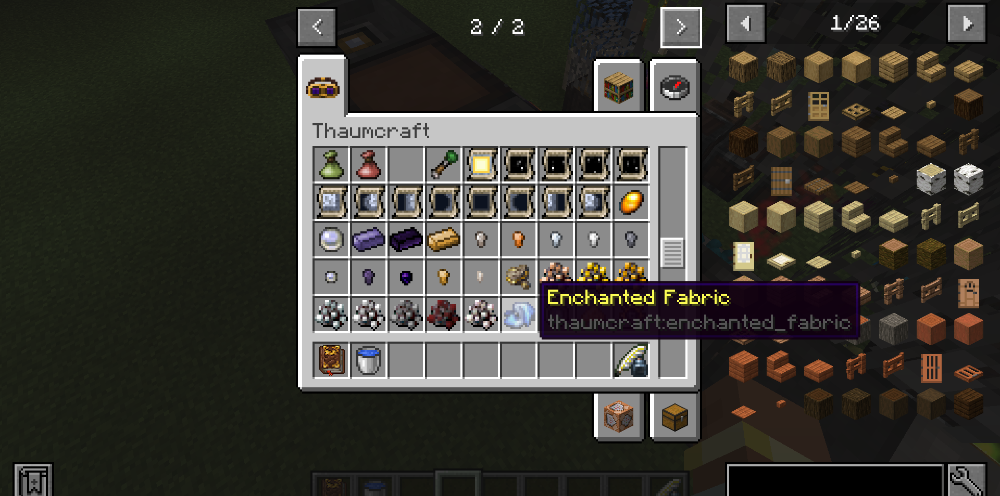
  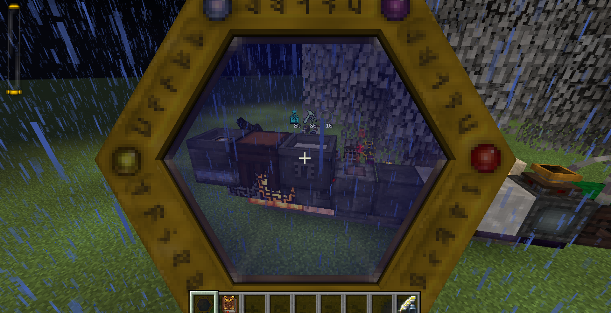
   
  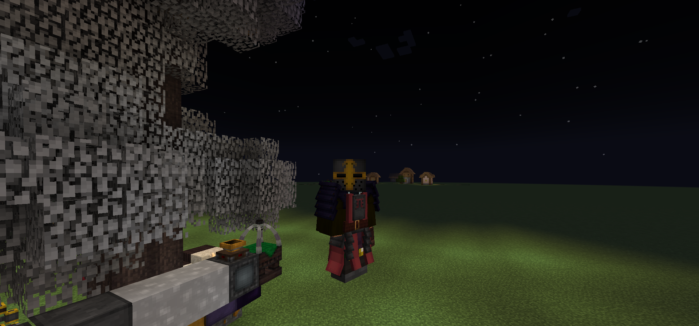

  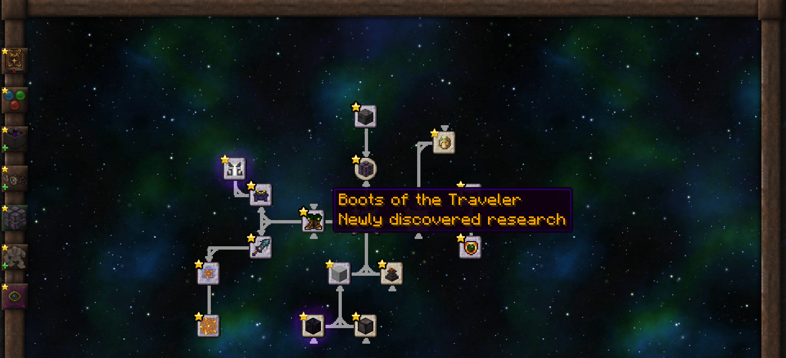
  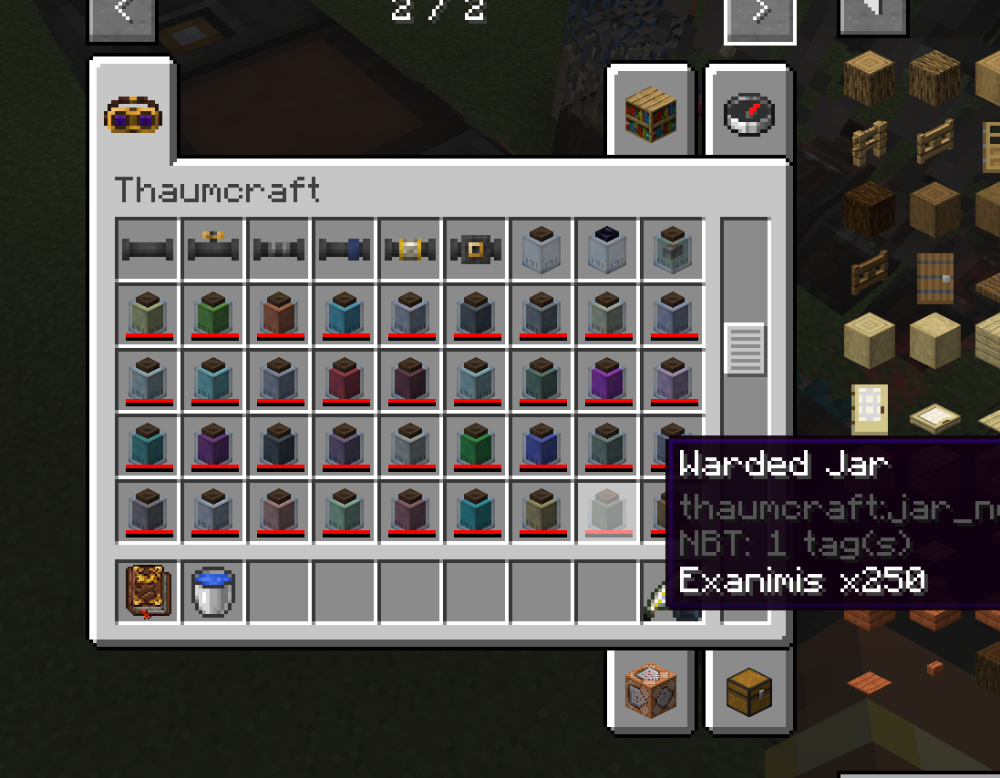
   
  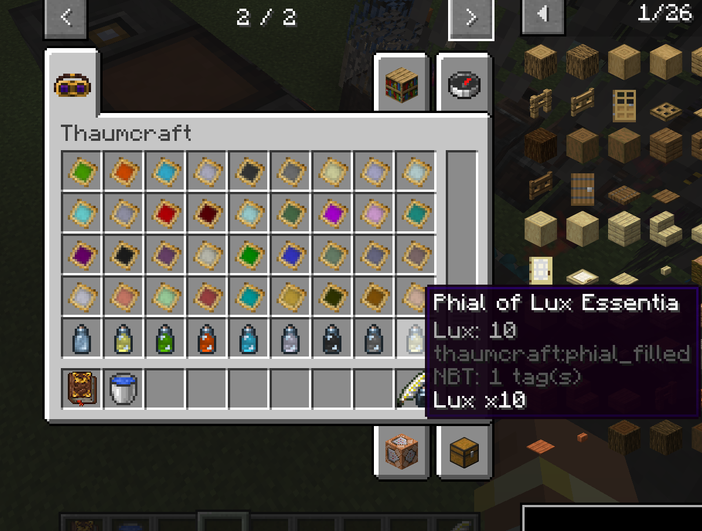

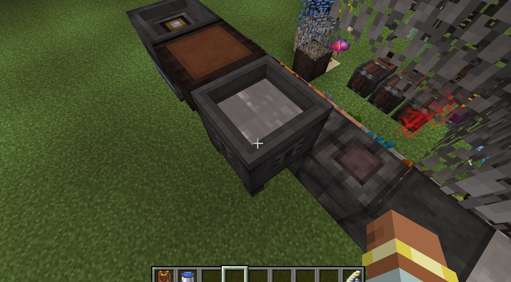

